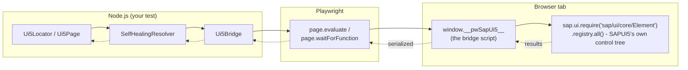
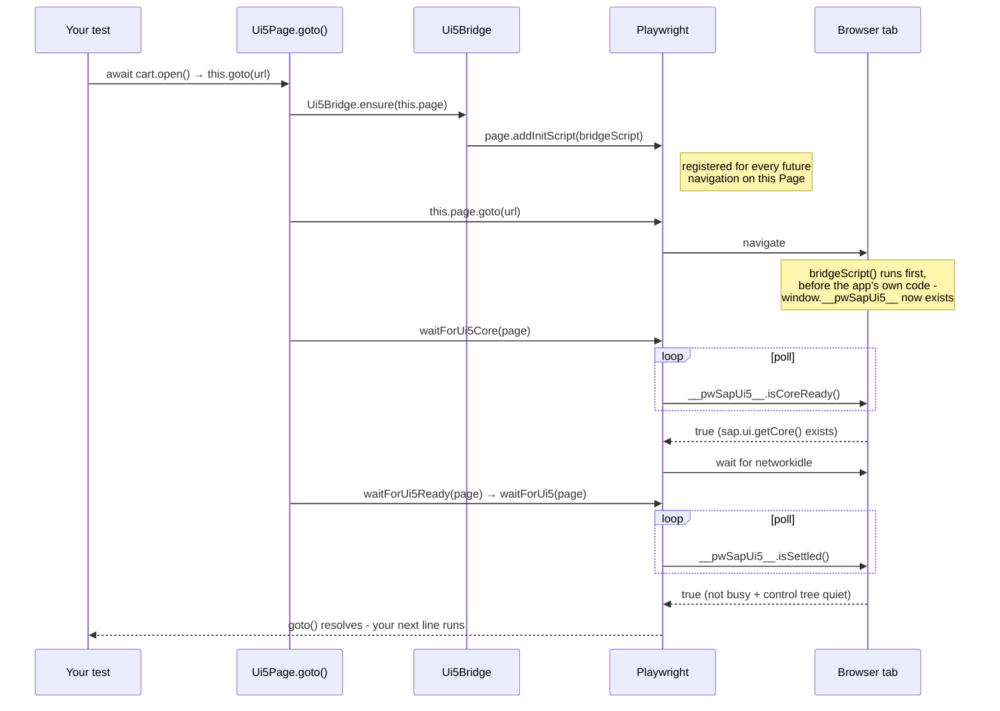
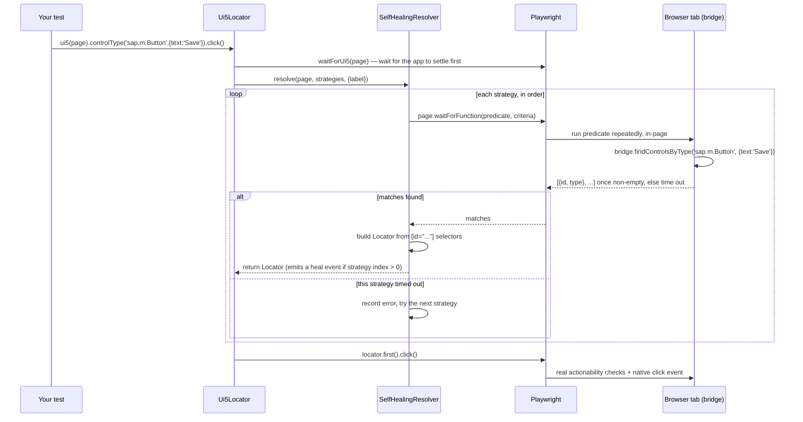

# Architecture: how the code actually works

> New to TypeScript? See [docs/typescript-for-beginners.md](typescript-for-beginners.md) if the
> code on this page looks unfamiliar.

Every other doc in this project explains how to _use_ the framework. This one explains how it's
_built_: which file does what, and exactly what happens, step by step, when you call things like
`ui5(page).controlType('sap.m.Button').click()`. You don't need to read this to use the framework

- but if you've ever wondered "wait, how does it actually _find_ the button?", this is where that
  question gets answered, with real code traced end to end.

## The big picture

Your test runs in **Node.js**. The SAPUI5 app you're testing runs in a **browser tab**, controlled
by Playwright. Playwright can send commands into the tab and run JavaScript inside it, but Node
and the browser are two separate processes/environments - they only talk through Playwright's own
message channel. This framework's one central trick is: it injects a small script into the
browser tab (the **bridge**) that reads SAPUI5's own control registry directly, and the Node side
calls into that bridge to ask "which controls match this description?" instead of guessing at DOM
structure from the outside.



## File map

Everything under `src/` is small and single-purpose on purpose - no file does more than one job.

| File                                                                                        | What it does                                                                                                                                                                                                                                                                                      |
| ------------------------------------------------------------------------------------------- | ------------------------------------------------------------------------------------------------------------------------------------------------------------------------------------------------------------------------------------------------------------------------------------------------- |
| [`src/index.ts`](../src/index.ts)                                                           | The public API surface. Everything a consumer can `import { ... } from 'playwright-sapui5'` is re-exported here, and nothing else is reachable from outside the package.                                                                                                                          |
| [`src/core/types.ts`](../src/core/types.ts)                                                 | Shared TypeScript types only - no runtime code. `Ui5LocatorCriteria`, `Ui5ControlInfo`, etc.                                                                                                                                                                                                      |
| [`src/core/Ui5Locator.ts`](../src/core/Ui5Locator.ts)                                       | The locator class: static factories (`.id`, `.controlType`, ...), chaining (`.fallback`, `.as`), and the convenience action methods (`.click`, `.fill`, ...).                                                                                                                                     |
| [`src/core/SelfHealingResolver.ts`](../src/core/SelfHealingResolver.ts)                     | Turns a _list_ of strategies into one Playwright `Locator`, trying each in order until one matches. This is where self-healing actually happens.                                                                                                                                                  |
| [`src/core/Ui5Bridge.ts`](../src/core/Ui5Bridge.ts)                                         | The Node-side half of the bridge: injects the browser script exactly once per target (`Page` _or_ `Frame` - see [`Ui5Target`](#cross-frame-page-or-frame-everywhere), race-condition-safe - see [below](#a-real-concurrency-bug-this-caught)), and exposes typed async methods that call into it. |
| [`src/core/waits.ts`](../src/core/waits.ts)                                                 | `waitForUi5Core` and `waitForUi5` - the two auto-wait primitives everything else is built on.                                                                                                                                                                                                     |
| [`src/core/Ui5Page.ts`](../src/core/Ui5Page.ts)                                             | The `abstract class` Page Objects extend. Thin wrappers around `Ui5Locator`'s factories, plus `goto()`. `Page`-only by design - see [docs/cross-frame.md](cross-frame.md#page-objects-and-frames).                                                                                                |
| [`src/core/ui5.ts`](../src/core/ui5.ts)                                                     | The `ui5(target)` fluent helper - a plain function returning an object of closures over `Ui5Locator`'s factories.                                                                                                                                                                                 |
| [`src/core/findUi5Frame.ts`](../src/core/findUi5Frame.ts)                                   | Locates the child iframe (if any) with its own ready SAPUI5 runtime - for Fiori Launchpad-style shells. See [docs/cross-frame.md](cross-frame.md).                                                                                                                                                |
| [`src/core/domSelectors.ts`](../src/core/domSelectors.ts)                                   | Tiny shared helpers (`idSelector`, `idsSelector`) for building `[id="..."]` CSS selectors from control ids - used by `SelfHealingResolver`, `Ui5Table`, and `Ui5Dialog`.                                                                                                                          |
| [`src/core/matchers.ts`](../src/core/matchers.ts)                                           | The custom `expect` matchers (`toHaveUi5Property`, `toHaveUi5Text`, `toBeUi5Busy`) and the TypeScript module augmentation that makes them type-check. See [docs/expect-matchers.md](expect-matchers.md).                                                                                          |
| [`src/core/Ui5Table.ts`](../src/core/Ui5Table.ts)                                           | Row/cell/header access for `sap.m.Table`/`sap.m.List`. See [docs/ui5-table.md](ui5-table.md).                                                                                                                                                                                                     |
| [`src/core/Ui5Dialog.ts`](../src/core/Ui5Dialog.ts)                                         | Open/interact-with/close helpers for `sap.m.Dialog`/`sap.m.Popover`. See [docs/ui5-dialog.md](ui5-dialog.md).                                                                                                                                                                                     |
| [`src/core/Ui5SmartFilterBar.ts`](../src/core/Ui5SmartFilterBar.ts)                         | Set filter values and search on a Fiori Elements SmartFilterBar via its own API. See [docs/smart-controls.md](smart-controls.md).                                                                                                                                                                 |
| [`src/core/Ui5SmartTable.ts`](../src/core/Ui5SmartTable.ts)                                 | True row count and inner-table type for a Fiori Elements SmartTable. See [docs/smart-controls.md](smart-controls.md).                                                                                                                                                                             |
| [`src/core/Ui5GridTable.ts`](../src/core/Ui5GridTable.ts)                                   | Row/cell/header access for `sap.ui.table.Table`'s virtualized rows, including `scrollToRow()`. See [docs/ui5-grid-table.md](ui5-grid-table.md).                                                                                                                                                   |
| [`src/core/Ui5ValueHelpDialog.ts`](../src/core/Ui5ValueHelpDialog.ts)                       | Opens a value help ("F4 help") dialog via its `-vhi` trigger icon and selects a result row. See [docs/value-help-dialog.md](value-help-dialog.md).                                                                                                                                                |
| [`src/core/odataMock.ts`](../src/core/odataMock.ts)                                         | `page.route()` wrappers that build correct OData V2/V4 JSON envelopes. See [docs/odata-mocking.md](odata-mocking.md). No bridge involvement - plain Playwright network interception.                                                                                                              |
| [`src/browser/bridgeScript.ts`](../src/browser/bridgeScript.ts)                             | **The only file that touches SAPUI5's own runtime.** Plain browser JavaScript, authored in a `.ts` file for type-checking convenience - see [The browser bridge, in detail](#the-browser-bridge-in-detail) below.                                                                                 |
| [`src/fixtures/test.ts`](../src/fixtures/test.ts)                                           | The `test`/`expect` you import instead of `@playwright/test`'s own - a thin `test.extend()` wrapper, `expect.extend()`ed with `matchers.ts`'s custom matchers.                                                                                                                                    |
| [`src/generator/generatePageObjectSource.ts`](../src/generator/generatePageObjectSource.ts) | Pure function: takes a control-tree dump, returns TypeScript source text for a Page Object. No I/O.                                                                                                                                                                                               |
| [`src/generator/initCommand.ts`](../src/generator/initCommand.ts)                           | The file-writing logic behind `pw-sapui5 init` - also pure-ish (takes options, writes files, returns a report).                                                                                                                                                                                   |
| [`src/generator/cli.ts`](../src/generator/cli.ts)                                           | The actual CLI entry point. Thin - it parses arguments (via `commander`) and calls into the two generator files above and `Ui5Bridge`/`waits`.                                                                                                                                                    |

## Flow 1: what `Ui5Page.goto(url)` actually does

This is the very first thing most tests call, and it's where the framework's trickiest ordering
requirement lives (see [docs/auto-wait.md](auto-wait.md#the-ordering-gotcha-bridge-installation-vs-navigation)
for _why_ - this section is about _what_, concretely, happens).



In code ([`Ui5Page.goto`](../src/core/Ui5Page.ts)):

```ts
async goto(url: string, options: WaitForUi5Options = {}): Promise<void> {
  await Ui5Bridge.ensure(this.page);     // 1. install the bridge BEFORE navigating
  await this.page.goto(url);              // 2. navigate
  await waitForUi5Core(this.page, options).catch(() => {}); // 3. wait for SAPUI5 to boot
  await this.waitForUi5Ready(options);    // 4. wait for the app to settle
}
```

Step 1 matters more than it looks: `page.addInitScript()` only affects documents that load
_after_ it's registered. If the bridge were installed after `goto()`, it would miss the app's own
bootstrap network activity, and `waitForUi5`'s busy-tracking would be wrong for that first
navigation. `Ui5Bridge.ensure()` is safe to call repeatedly - it tracks which `Page` objects it's
already handled in a `WeakSet`, so calling it again later (which several other code paths do, as
you'll see below) is a cheap no-op.

## Flow 2: what `.click()` actually does

This is the framework's core mechanism - the same round trip happens for every action method
(`.fill()`, `.check()`, `.hover()`, ...), not just `.click()`.



Walking the actual code:

1. **`Ui5Locator.click()`** ([`Ui5Locator.ts`](../src/core/Ui5Locator.ts)) calls `this.prepare(options)`,
   which - unless you passed `{ autoWaitUi5: false }` - calls `waitForUi5(this.page, ...)` first.
   This is why every action auto-waits without you asking for it.
2. `prepare()` then calls `this.resolve(...)`, which delegates straight to
   **`SelfHealingResolver.resolve(page, strategies, { timeout, label })`**.
3. `SelfHealingResolver.resolve()` loops over your strategies array (just one entry, unless you
   chained `.fallback(...)`) and calls the module-private `resolveCriteria()` for each, in order,
   inside a `try`/`catch` - a strategy that throws (times out with no matches) just moves on to
   the next one.
4. **`resolveCriteria()`** is where the actual browser round trip happens. For a `controlType`
   strategy, it calls `Ui5Bridge.ensure(page)` (a no-op if `goto()` already did it), then
   `page.waitForFunction(predicate, criteria, { timeout })`. Playwright evaluates `predicate`
   **inside the browser**, repeatedly, until it returns a truthy value or the timeout elapses -
   and inside that predicate, `bridge.findControlsByType(...)` is called on
   `window.__pwSapUi5__`, the object the bridge script set up.
5. Once the browser-side call returns a non-empty array, `waitForFunction` resolves with a
   `JSHandle`; `resolveCriteria()` reads it via `.jsonValue()` to get a plain
   `Ui5ControlInfo[]` back in Node, then calls **`controlsToLocator()`**, which builds a real
   Playwright `Locator` from a `[id="..."], [id="..."]` selector - one clause per matched control.
6. Back in `SelfHealingResolver.resolve()`: if this was strategy index `> 0` (a fallback, not the
   primary), it emits a `HealEvent` to any `onHeal()` listeners and logs a `console.warn`. Either
   way, the `Locator` is returned up the chain.
7. **Back in `Ui5Locator.click()`**, it's now got an ordinary Playwright `Locator` and simply
   calls `.first().click(options)` on it - from this point on, it's 100% standard Playwright:
   actionability checks (visible, stable, enabled, receives events), auto-retry, the works. The
   framework's job was entirely in _finding_ the element; acting on it is Playwright's own,
   unmodified machinery.

## Flow 3: self-healing, traced through a failure

To make the fallback behavior concrete, here's what happens for
`ui5(page).id('renamed').fallback({ by: 'text', text: 'Laptops', controlType: 'sap.m.StandardListItem' }).click()`
when the id `renamed` doesn't exist (see
[`examples/tests/self-healing.spec.ts`](../examples/tests/self-healing.spec.ts) for the real,
passing version of this):

1. `strategies` is `[{ by: 'id', value: 'renamed' }, { by: 'text', text: 'Laptops', controlType: 'sap.m.StandardListItem' }]`.
2. `perStrategyTimeout` splits the overall budget in two (see the `Math.max(1000, Math.floor(totalTimeout / strategies.length))`
   line in `SelfHealingResolver.resolve()`).
3. **Iteration 0**: `resolveCriteria()` calls `bridge.findControlsById('renamed', undefined)` in
   a loop (via `waitForFunction`) until the per-strategy timeout - nothing ever matches, so
   `waitForFunction` throws a `TimeoutError`. The `catch` block in `resolve()`'s `for` loop
   catches it, stores it as `lastError`, and the loop continues.
4. **Iteration 1**: `resolveCriteria()` calls `bridge.findControlsByText('Laptops', 'sap.m.StandardListItem', undefined)`
   - this one matches almost immediately. `controlsToLocator()` builds the `Locator`, and because
     `i === 1` (not `0`), `SelfHealingResolver` emits a `HealEvent` and logs the warning you saw in
     this repo's own test output:
   ```
   [playwright-sapui5] Self-healed locator "..." using fallback #2: {"by":"text",...}
   ```
5. The resolved `Locator` is returned; `.click()` proceeds normally from there. The test never
   sees a failure - only the logged warning (and, if it subscribed via `SelfHealingResolver.onHeal()`,
   a `HealEvent` object with the same information).

If _both_ strategies had failed, the `for` loop would exhaust with no `return`, and the function
falls through to the final `throw new Error(...)` - the "All N locator strategies failed" message
you'd see, with `lastError` (the most recent underlying failure) included for debugging.

## The browser bridge, in detail

[`src/browser/bridgeScript.ts`](../src/browser/bridgeScript.ts) is unlike every other file in this
project: it's TypeScript source, but it **never runs in Node**. Playwright's `page.addInitScript()`
and `page.evaluate()` both accept a function reference and serialize it with
`Function.prototype.toString()` to run inside the browser - which means the function must be
**fully self-contained**. No imports, no references to variables outside its own body, because
none of that context exists on the other side. That's why it's one large function with everything

- helpers included - declared inside it, rather than the normal multi-file structure the rest of
  this codebase uses.

What it does, in order, the first time it runs on a fresh document:

1. **Guards against double-injection**: `if (w.__pwSapUi5__) return;` - since both
   `addInitScript` (every future navigation) and the one-off `evaluate` call (the current
   document) can both end up running it.
2. **Instruments `fetch` and `XMLHttpRequest.prototype.send`** to track `bridge.pendingRequests`
   - a plain counter, incremented on send, decremented on completion. This is one of the signals
     `isBusy()` checks.
3. **Defines `getAllRegisteredElements()`**: reads SAPUI5's own control registry. It tries the
   modern API first - `sap.ui.require('sap/ui/core/Element').registry.all()`, called with
   `sap.ui.require`'s _synchronous_, single-argument form (which returns the module if it's
   already loaded, which by the time anything has rendered, it always is) - and falls back to the
   older `Core.getElementRegistry()` / `Core.mElements` for pre-~1.95 UI5.
4. **Defines `getAllElements()`**: `getAllRegisteredElements()` filtered down to controls that
   actually have a live DOM node right now (`control.getDomRef()` is non-null). This is the
   function everything else in the bridge actually uses - it's what excludes non-visual objects
   (`CustomData`, routing helpers) and not-yet-rendered controls. See
   [docs/core-concepts.md](core-concepts.md#why-controls-without-a-dom-presence-dont-show-up) for
   why this matters.
5. **Defines the four `findControlsBy*` functions** (`ById`, `ByType`, `ByBindingPath`, `ByText`)
   - each filters `getAllElements()`'s result by reading properties straight off the live control
     objects (`el.getMetadata().getName()`, `el.getText()`, `el.getBindingContext()`, ...) and maps
     matches down to the minimal `{ id, type }` shape (`Ui5ControlInfo`) that actually needs to
     cross back into Node - the full control object can't be serialized across that boundary, only
     plain data.
6. **Defines `isBusy()` and `isSettled()`**: `isBusy()` checks the global `BusyIndicator`, every
   control's own `busy` property, and `pendingRequests`. `isSettled()` additionally tracks the
   _count_ of `getAllElements()` over time, in module-level `let` variables (`lastControlCount`,
   `lastChangeAt`) that persist between calls because this whole script only runs once per
   document - and only returns `true` once that count has been unchanged for `QUIET_PERIOD_MS`.
   See [docs/auto-wait.md](auto-wait.md#why-busy-alone-isnt-enough) for why both checks exist.
7. **Defines `dumpControlTree()`**, used only by the [generator](#the-generate-cli-flow) - like
   the `findControlsBy*` functions, but returns every control (not filtered by a query) with a
   few extra fields (`properties`, `parentId`) the generator uses for naming and comments.
8. **Defines five more functions for the "advanced feature" building blocks**: `getControlProperty`
   and `getControlText` (exact-id lookups, backing the [custom matchers](expect-matchers.md)),
   `findDescendantControlsByType` and `getAggregation` (scoped/aggregation-based searches, backing
   [`Ui5Table`](ui5-table.md) and [`Ui5Dialog`](ui5-dialog.md)), and `findOpenPopups` (anything
   with `isOpen() === true`, backing `Ui5Dialog.open()`).
9. **Attaches everything it wants Node to be able to call** onto the `bridge` object:
   `bridge.isCoreReady`, `bridge.isBusy`, `bridge.isSettled`, `bridge.findControlsById`, and all of
   the above.

Every method that later "calls into the bridge" from Node - `Ui5Bridge.isBusy()`,
`resolveCriteria()`'s `waitForFunction` predicate, and so on - is just reading one of these
properties off `window.__pwSapUi5__` inside a `page.evaluate`/`page.waitForFunction` callback.

## A real concurrency bug this caught

While building `Ui5Dialog`, a test that navigated directly (`page.goto(url)`, not through
`Ui5Page.goto()`) and then immediately called `Ui5Dialog.open(page, ...)` failed intermittently
with `Cannot read properties of undefined (reading 'findOpenPopups')` - `window.__pwSapUi5__`
genuinely didn't exist yet at the moment it was read. Worth walking through, because the root
cause is a general lesson about async code, not something specific to dialogs.

`Ui5Bridge.ensure()` is called defensively from many places - `Ui5Locator`, `waitForUi5`,
`Ui5Page.goto()`, and this framework's own `test` fixture's `page.on('load', ...)` listener (see
[`src/fixtures/test.ts`](../src/fixtures/test.ts)) - often without anything waiting for one
caller's `ensure()` to finish before another starts. The original implementation tracked "has this
`Page` been set up" with a `WeakSet<Page>` flag:

```ts
// the buggy version
if (initializedPages.has(page)) return;
initializedPages.add(page); // <- marked "done" here...
await page.addInitScript(bridgeScript);
await page.evaluate(bridgeScript); // <- ...before this actually finished
```

The bug: `initializedPages.add(page)` runs _synchronously_, before either `await` below it. If a
second call to `ensure()` for the same `page` happened while the first was still in the middle of
those two `await`s - exactly what the `page.on('load')` listener's fire-and-forget `waitForUi5`
call racing against a test's own immediate next line produces - it would see the flag already set
and return immediately, letting code that assumed the bridge was ready run against a document
where it wasn't there yet.

The fix ([`src/core/Ui5Bridge.ts`](../src/core/Ui5Bridge.ts)) stores the _Promise_ of the
installation, not just a boolean, in a `WeakMap<Page, Promise<void>>`:

```ts
let installation = bridgeInstallations.get(page);
if (!installation) {
  installation = installBridge(page); // starts the work AND is stored, in the same tick
  bridgeInstallations.set(page, installation);
}
await installation; // every caller - first or concurrent - awaits the same real completion
```

Now every caller, whenever they call `ensure()`, either starts the one-and-only installation or
finds the _same in-flight Promise_ already stored and awaits its actual completion - there's no
window where a second caller can observe "started" as if it meant "finished." This is a common
enough pattern worth recognizing: whenever you're deduplicating concurrent async work with a
cache, cache the `Promise`, not a boolean derived from having started it.

## Cross-frame: Page or Frame everywhere

Everything traced above is described in terms of a `Page`, but `Ui5Bridge`, `waitForUi5Core`/
`waitForUi5`, `Ui5Locator`'s static factories, and `ui5(...)` are actually all typed to accept a
`Ui5Target`:

```ts
// src/core/Ui5Bridge.ts
export type Ui5Target = Page | Frame;
```

This exists for one specific scenario: a SAPUI5 app embedded inside an `<iframe>`, the way Fiori
Launchpad loads each tile's target app. That app's control tree lives in a different Playwright
`Frame` than the shell around it - see [docs/cross-frame.md](cross-frame.md) for the full guide
and [`examples/tests/cross-frame.spec.ts`](../examples/tests/cross-frame.spec.ts) for a complete
working example.

It works at all because `Page` and `Frame` share the exact same `.evaluate()`,
`.waitForFunction()`, `.locator()`, and `.getByRole()` methods this file's `installBridge`,
`resolveCriteria`, and `controlsToLocator` (all traced above) actually call - none of that code
needed to change, only its parameter types. The one method that genuinely differs is
`page.addInitScript()`, which only exists on `Page`. `Ui5Bridge.ensure(target)` handles this with a
small helper:

```ts
function ownerPage(target: Ui5Target): Page {
  const maybeFrame = target as Frame;
  return typeof maybeFrame.page === 'function' ? maybeFrame.page() : (target as Page);
}
```

`Frame` has a `.page()` method returning the `Page` that owns it; `Page` has no such method - that
asymmetry is the only way, at runtime, to tell which one was passed in. `installBridge` then does
two things: registers the init script on the _owning_ `Page` (`ownerPage(target).addInitScript(...)`,
covering every current and future frame on that page automatically), and separately calls
`target.evaluate(bridgeScript)` for the specific target passed in (in case that frame's document
already finished loading before `ensure()` was called - `addInitScript` only affects _future_
navigations, never a document that's already there).

`findUi5Frame(page, options?)` ([`src/core/findUi5Frame.ts`](../src/core/findUi5Frame.ts)) is the
piece that finds the right `Frame` to pass in: it polls every frame on `page` other than the main
frame, calling `Ui5Bridge.isCoreReady(frame)` on each, and returns the first one that's ready. The
main frame is deliberately excluded - in a real launchpad, the shell itself is a SAPUI5 app too, so
including it would usually just find the shell again.

`Ui5Page` stays `Page`-only on purpose - see
[docs/cross-frame.md#page-objects-and-frames](cross-frame.md#page-objects-and-frames) for why - and
the custom `expect` matchers, `Ui5Table`, and `Ui5Dialog` aren't frame-aware yet, because they all
go through `Locator.page()` internally, which always returns the top-level `Page` regardless of
which frame the locator was actually built from. See
[docs/cross-frame.md#current-limitations](cross-frame.md#current-limitations).

## Test execution flow: what happens when you run `npx playwright test`

This part is entirely Playwright's own machinery, but it's worth walking through once so the
pieces above have a home:

1. Playwright's test runner discovers every file matching `testDir` (see `playwright.config.ts`)
   and, for each, opens a fresh **browser context** (cookies/storage isolated from every other
   test) and a `page` inside it.
2. If you're using this framework's `test` (from `'playwright-sapui5'`, not `@playwright/test`),
   its `page` fixture ([`src/fixtures/test.ts`](../src/fixtures/test.ts)) wraps the real `page`
   fixture: it attaches a `page.on('load', ...)` listener that opportunistically calls
   `waitForUi5(page, { timeout: 5000 })` in the background after every full page load - a small
   head start on auto-waiting, best-effort, never failing the test if it doesn't settle in time.
3. Your test function runs, receiving that `page` (and whatever other fixtures you destructured,
   like `testInfo`).
4. Every `Ui5Page`/`Ui5Locator` call inside it follows [Flow 1](#flow-1-what-ui5pagegotourl-actually-does)
   or [Flow 2](#flow-2-what-click-actually-does) above.
5. When the test function returns (or throws), Playwright tears down the context - closing the
   page discards `window.__pwSapUi5__` along with everything else in that browser tab; nothing
   from the bridge persists between tests, and nothing needs to.

## The `generate` CLI flow

Briefly - see [docs/generator.md](generator.md) for the full picture:
[`src/generator/cli.ts`](../src/generator/cli.ts)'s `generate` command launches its own Chromium
instance (not through the Playwright _test_ runner at all - just `chromium.launch()` directly),
calls `Ui5Bridge.ensure(page)` before navigating (same ordering rule as `Ui5Page.goto()`), waits
via `waitForUi5Core` + `waitForUi5`, then calls `Ui5Bridge.dumpControlTree(page)` and pipes the
result through the pure function `generatePageObjectSource()` to produce the `.ts` file it writes
to disk.

## The `init` CLI flow

[`src/generator/initCommand.ts`](../src/generator/initCommand.ts)'s `runInit()` does no browser
automation at all - it's pure file I/O: a handful of template strings, and a
`writeFileIfAbsent()` helper that checks `existsSync()` before ever writing, so it's safe to run
more than once. See [docs/init.md](init.md).

## Build vs. runtime: two different worlds

You'll see two different ways this library gets imported, and it's worth knowing why both work:

- **`import { ... } from '../../src'`** (used throughout `examples/`) - Playwright's test runner
  has its own built-in TypeScript transform and compiles `.ts` files on the fly, so the example
  tests import the library's _source_ directly. No build step needed to run them.
- **`import { ... } from 'playwright-sapui5'`** (used by real consumers) - resolves through
  `node_modules/playwright-sapui5`, whose `package.json` `"main"` field points at `dist/index.js`
  - the plain CommonJS JavaScript that `npm run build` (`tsc -p tsconfig.build.json`) produces.
    Consumers never see or need the TypeScript source at all.

Both paths end up running the exact same logic - `dist/` is just the compiled, published form of
`src/`.

## Where to go next

- [docs/core-concepts.md](core-concepts.md) - the _why_ behind these mechanisms, if you haven't
  read it yet.
- [docs/auto-wait.md](auto-wait.md) - a deeper dive on `isSettled()`'s quiet-period logic and its
  tuning options.
- [docs/api-reference.md](api-reference.md) - every exported symbol, without the narrative.
